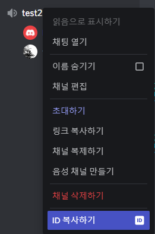
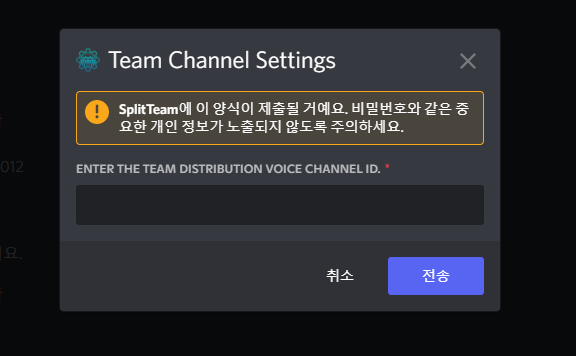
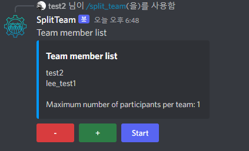
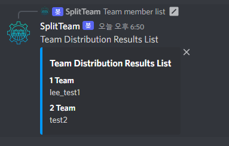

# Discord SplitTeam BOT

The method of using an external program to divide a team and then sharing it with the teams on Discord is too complicated. It is a bot program that eliminates this method and can easily divide teams with simple commands.

## How To use

- Get the voice channel ID

- Enter the "/팀채널설정하기" command and paste the copied channel ID

- "/팀나누기" command
- Set the maximum number of people per team with the + and - buttons
- After setting, click the start button

- Randomly distribute teams
